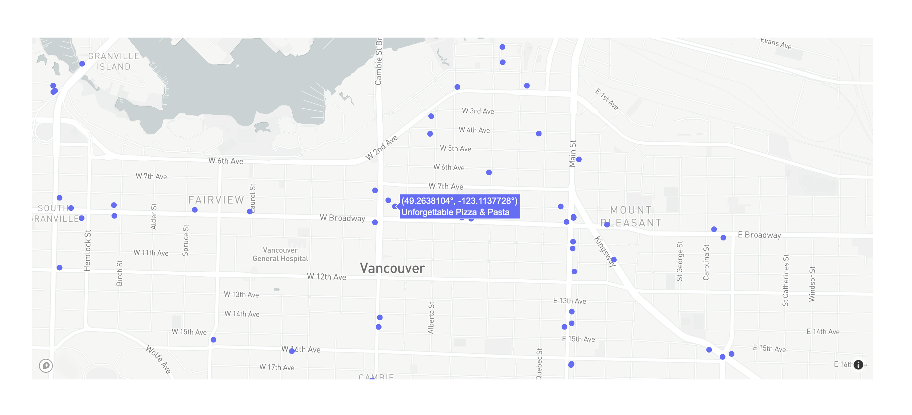

# cmpt-732-galv-project

- Clone repository
- Install dependencies

```
pip3 install -r requirements.txt
```

- Download yelp dataset from here [Yelp Dataset](https://www.yelp.com/dataset/download)
- Download Tableau Reader from here [Tableau Reader](https://www.tableau.com/products/reader)

**ETL Steps**

This step will clean, extract and transform the relevant fields from the yelp-business json for the purpose of visualization in Tableau and use to feed data to "similar business search CLI" App . The below code writes the results in the `output` folder
```
spark-submit business-etl.py {downloaded-yelp-dataset}/yelp_academic_dataset_business.json.gz businesses,categories,restaurants,attributes,hours
spark-submit diet-restrictions-etl.py ./output/attributes.parquet output
spark-submit tableau_diet_restriction.py ./output/DietaryRestrictions.json ./output/restaurants.parquet output/diet
spark-submit tableau_attributes.py ./output/attributes.parquet ./output/restaurants.parquet output/restaurant-facilities
spark-submit user_data_ingestion.py {downloaded-yelp-dataset}/yelp_academic_dataset_user.json ./output/user
spark-submit business_data_filter.py {downloaded-yelp-dataset}/yelp_academic_dataset_business.json ./output/restaurants.parquet ./output/data

# CSV files stored in output/diet and output/restaurant-facilities directories are further used in the Tableau Workbook
# CSV files stored in output/data is further used to feed data for similar business search CLI App.
```

**ML**

With the below code we want the model to learn how the facilities of a restaurant affect its ratings. We feed 15 attributes/features to the model and predict the rating against the ratings provided by Yelp. This could be used to predict the initial ratings of a new restaurant based on the facilities it provides. In this model, we find out that features like `WheelchairAccessible` , `DogsAllowed` are given more weightage while predicting the rating. We get an accuracy of ~82%.
```
spark-submit ml.py ./output/restaurants.parquet,./output/attributes.parquet output
```

[Optional] as the above command already prints the test results. Once the training is done you can test the saved model on the test set using the below command.
```
spark-submit test-model.py ./output/model ./output/test-set
```

**Tableau**

The Tableau Workbook is already connected to the CSV files that were created during the above ETL steps. Dietary Restriction Dashboard gives the number of restaurants that offer food for people with dietary restrictions such as gluten allergy, lactose intolerance etc. and also plots their location on a map. Restaurant Facilities Dashboard shows for each state, the total number of restaurants available for various kinds of services. This can further be drilled down for each city.


# Similar Business Search CLI App

An app that let's you look up similar businesses based on "categories" column in business.json data file. Once similar businesses are found it quickly plots them on a map for the user to view it. Head to the `app` folder for more details.



## Usage

Download [GloVe Embeddings](https://nlp.stanford.edu/data/glove.6B.zip), store and extract in the same app folder. Then run:

```bash
python app/main.py --path "data" --location_str "vancouver" --attributes "pizza" --threshold "15.0"
```

## Helps you find your next business opportunity
When a user is undecided on what restaurant/cuisine to open for a business opportunity this app can help you decide that. Just look up "Sushi" in Vancouver around 15kms and it will show all businesses that have 'sushi' or a category or find similar business category if 'sushi' is not available

## Smart business look up
What if given category is not available in data?
Fret not, the app uses [GloVe](https://nlp.stanford.edu/projects/glove/) embeddings to first map user provided attribute to an embedding and then it uses [cosine similarity](https://en.wikipedia.org/wiki/Cosine_similarity#Definition) to find most similar businesses in case the user provided attribute/category is not available in categories column.

# Reviews Sentiment Mining

These steps will let you get a table count of the most used ngrams across positive and negative reviews and positive, and negative, and neutral sentence sentiments for a list of restaurants.

## Getting reviews for all restaurants

Filters the yelp review dataset for restaurants only and eliminates non relevant columns.
```
spark-submit create_reviews_parquet.py output/restaurants.parquet {downloaded-yelp-dataset}/yelp-reviews.json.gz output
```

## Mining reviews for specific restaurants

This command generates a table count of ngrams and the frequency they appear in the reviews grouped by restaurants,
review rating, and sentence sentiment.

**Usage:**

```
spark-submit --packages com.johnsnowlabs.nlp:spark-nlp_2.12:3.3.4 get_reviews_ngram_counts.py <reviews file> <business ids> <ngram> <output>

inputs:
<reviews file> : parquet file of reviews
<business ids> : txt file with list of businesses ids to perform review mining on. Should be in local not hdfs
<ngram> : length of ngram
<output> : output folder

outputs:
n_grams_count.csv

```

**Example used in the report:**

```

spark-submit --packages com.johnsnowlabs.nlp:spark-nlp_2.12:3.3.4 get_reviews_ngram_counts.py data/reviews.parquet businesses_id.txt 2 ./data/output

```

**Tableu Visualization:**

Histogram of ngram count of the top 5 pizza restaurants with more than 100 reviews grouped by review (positive or negative) and sentiment (positive, negative or neutral)

 | 


 | 
